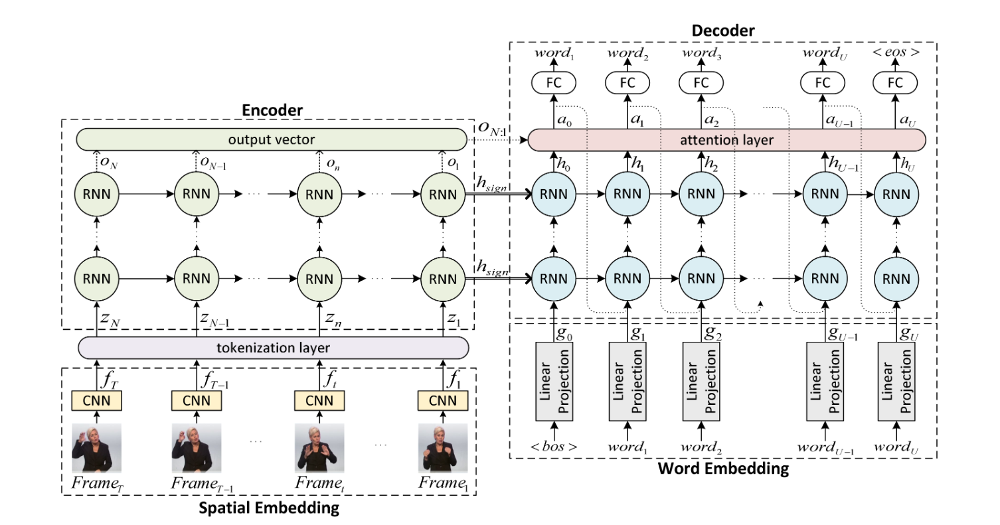
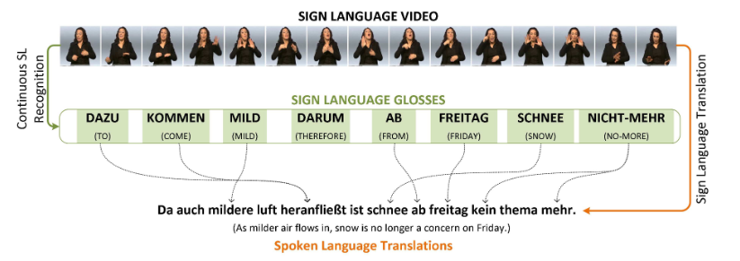

## NSLT.tensorflow <br><sub>Tensoflow 1.11 implementation of the Neural Sign Language Translation CVPR 2018 paper</sub>

</img>

Implementation of Sign2Text setup for translation of sign language videos to spoken language text
from the paper <a href="https://openaccess.thecvf.com/content_cvpr_2018/papers/Camgoz_Neural_Sign_Language_CVPR_2018_paper.pdf">Neural Sign Language Translation</a>

This repo contains code from <a href="https://github.com/neccam/nslt">neccam/nslt</a> and <a href="https://github.com/tensorflow/nmt">tensorflow/nmt</a> modified for working with Tensorflow v1.11 for research and learning purposes.

**Neural Sign Language Translation**<br>
Necati Cihan Camgoz, Simon Hadfield, Oscar Koller, Hermann Ney, Richard Bowden<br>
https://github.com/neccam/nslt<br>

Abstract: *We formalize SLT in the framework of Neural Machine
Translation (NMT) for both end-to-end and pretrained settings (using expert knowledge). This allows us to jointly
learn the spatial representations, the underlying language model, and the mapping between sign and spoken language.
To evaluate the performance of Neural SLT, we collected the first publicly available Continuous SLT dataset,
RWTH-PHOENIX-Weather 2014T1. It provides spoken language translations and gloss level annotations for German Sign
Language videos of weather broadcasts. Our dataset contains over .95M frames with >67K signs from a
sign vocabulary of >1K and >99K words from a German vocabulary of >2.8K. We report quantitative and
qualitative results for various SLT setups to underpin future research in this newly established field.
The upper bound for translation performance is calculated at 19.26 BLEU-4,
while our end-to-end frame-level and gloss-level tokenization networks were able to achieve 9.58 and 18.13 respectively.*

</img>

## Requirements
* Download and extract [RWTH-PHOENIX-Weather 2014 T: Parallel Corpus of Sign Language Video, Gloss and Translation](https://www-i6.informatik.rwth-aachen.de/~koller/RWTH-PHOENIX-2014-T/) and then resize the images to 227x227
* Download and install Tensorflow >= 1.11 < 1.15
* Download [AlexNet TensorFlow weights](https://www.cs.toronto.edu/~guerzhoy/tf_alexnet/bvlc_alexnet.npy) and put it under the folder BaseModel
* Python 3.6

## Usage

Usage prescribed by original NSLT(Camgoz, CVPR2018 paper)
```bash
python -m nslt \
        --src=sign \
        --tgt=de \
        --train_prefix=modeldata/phoenix2014T.train \
        --dev_prefix=modeldata/phoenix2014T.dev \
        --test_prefix=modeldata/phoenix2014T.test \
        --out_dir=./nslt_model \
        --vocab_prefix=modeldata/phoenix2014T.vocab \
        --source_reverse=True \
        --num_units=1000 \
        --num_layers=4 \
        --num_train_steps=150000 \
        --steps_per_stats=100 \
        --residual=True \
        --attention=luong \
        --base_gpu=0 \
        --metrics=bleu \
        --unit_type=gru
```
Experiments and Tests performed using following low resource usage command
```bash
python -m nslt \
        --src=sign \
        --tgt=de \
        --train_prefix=modeldata/phoenix2014T.train \
        --dev_prefix=modeldata/phoenix2014T.dev \
        --test_prefix=modeldata/phoenix2014T.test \
        --out_dir=./nslt_model \
        --vocab_prefix=modeldata/phoenix2014T.vocab \
        --source_reverse=True \
        --num_units=32 \
        --num_layers=2 \
        --learning_rate=0.001 \
        --src_max_len=100 \
        --tgt_max_len=50 \
        --src_max_len_infer=150 \
        --num_train_steps=150 \
        --steps_per_stats=2 \
        --residual=True \
        --attention=luong \
        --base_gpu=0 \
        --metrics=bleu \
        --unit_type=gru
```

## Inference Usage

```bash
python -m nslt \
        --out_dir=./nslt_model \
        --inference_input_file=modeldata/phoenix2014T.test.sign \
        --inference_output_file=./phoenix2014T.test.inf_out.de \
        --inference_ref_file=modeldata/phoenix2014T.test.de \
        --base_gpu=0
```

## View Logging in Tensorboard

```bash
tensorboard --port 22222 --logdir ./nslt_model
```


## Citations

```bibtex
@inproceedings{camgoz2018neural,
    author    = {Necati Cihan Camgoz and Simon Hadfield and Oscar Koller and Hermann Ney and Richard Bowden},
    title     = {Neural Sign Language Translation},
    booktitle = {IEEE Conference on Computer Vision and Pattern Recognition (CVPR)},
    year      = {2018}
}
```

```bibtex
@article{luong17,
    author  = {Minh{-}Thang Luong and Eugene Brevdo and Rui Zhao},
    title   = {Neural Machine Translation (seq2seq) Tutorial},
    journal = {https://github.com/tensorflow/nmt},
    year    = {2017},
}
```
```bibtex
@article{olah2016attention,
    author  = {Olah, Chris and Carter, Shan},
    title   = {Attention and Augmented Recurrent Neural Networks},
    journal = {Distill},
    year    = {2016},
    url     = {http://distill.pub/2016/augmented-rnns},
    doi     = {10.23915/distill.00001}
}
```

## Development

This implementation was developed in December 2018 and is treated as a one-time backup code drop.
